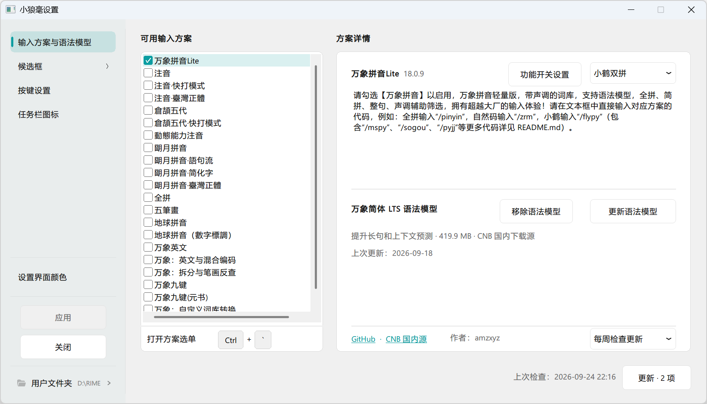
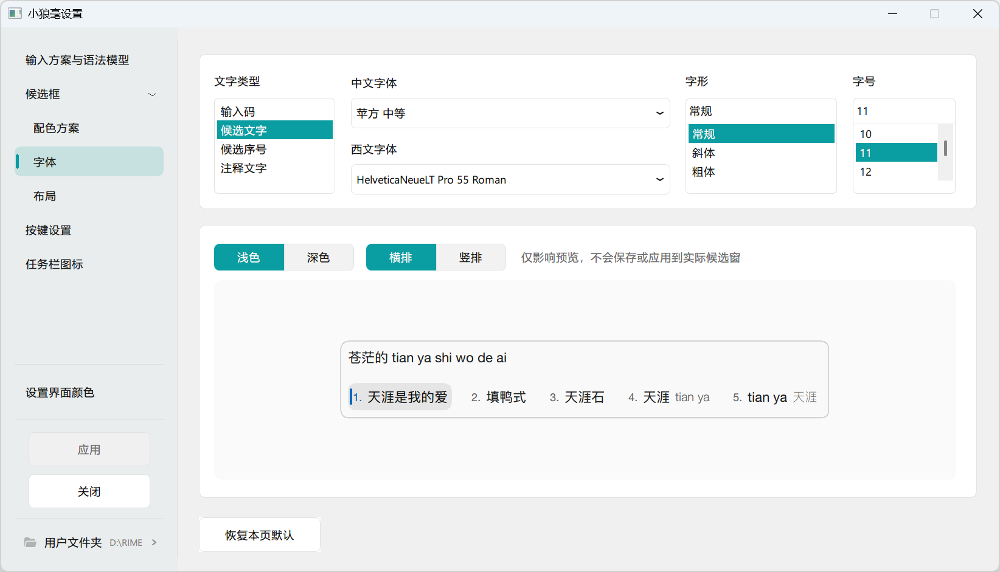
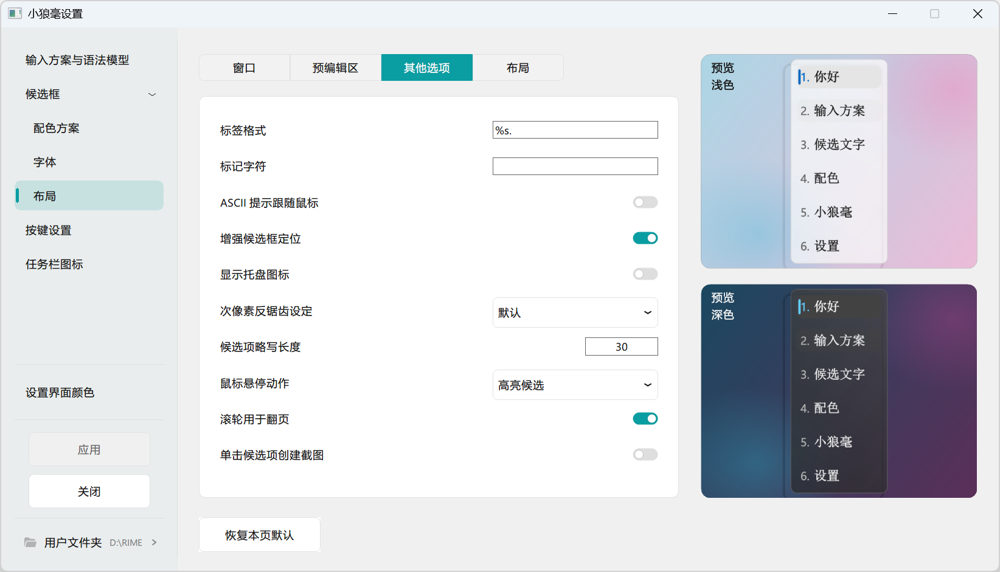
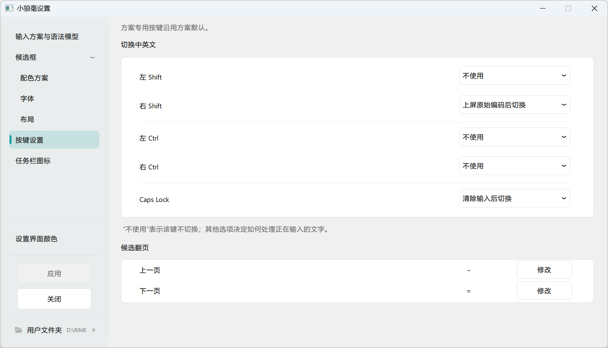
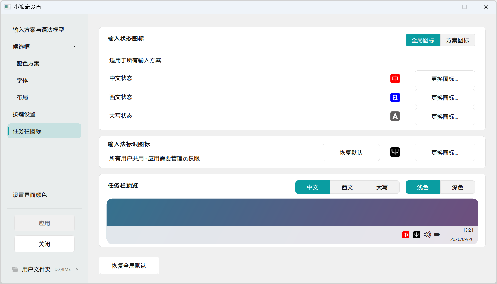
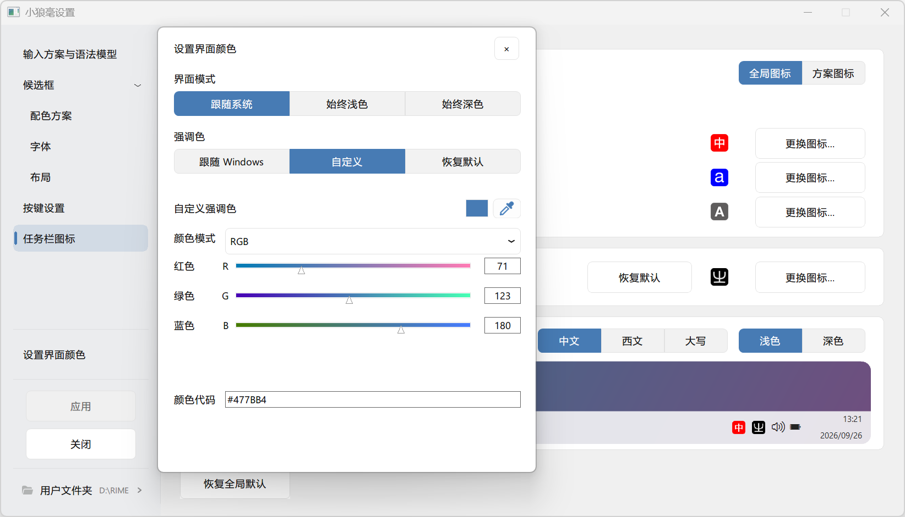

# 小狼毫 Weasel · 图形化定制版

本改版基于[原版小狼毫 Weasel](https://github.com/rime/weasel)和[中州韵 Rime 输入法引擎](https://github.com/rime/librime)，将输入方案、候选框外观、按键和任务栏图标等常用设置集中到图形界面，同时保留 Rime 的方案与用户自定义配置机制。**这里不是 Rime 官方发布版。**本改版的说明和截图在前，原版小狼毫的介绍、使用说明与致谢保留在本文后半部分。

## 改版特点

### 输入方案与语法模型

设置页默认进入「输入方案与语法模型」。左侧列出可用方案，勾选后启用；右侧显示所选方案的说明、版本及相关资源。安装包内置可直接使用的万象拼音 Lite；万象简体 LTS 语法模型是可选下载项，可以单独安装、更新或移除，**不包含在安装包中**。方案与模型支持检查更新，检查频率可在界面中选择。

「功能开关设置」用于指定打开方案时的默认状态，并读取方案文件及用户自定义配置中的已有设置；输入过程中需要临时切换时，可使用任务栏菜单中的「当前方案快捷开关」，常用项可固定在菜单中。这两种用途分开，不必为了临时切换反复修改默认配置。

### 候选框配色

可启用或关闭亚克力磨砂效果，选择跟随系统、固定浅色或固定深色界面，并从现有配色方案开始编辑。自定义颜色按候选框、输入码、普通候选、选中候选等对象分类；可以使用取色器、颜色代码、透明度及 RGB、HSV、HSL、CMYK 等数值方式调整。右侧同时给出浅色与深色候选框预览，便于对照文字、标签、注释与背景的效果。

### 候选框字体

输入码、候选文字、候选序号和注释文字可分别设置中文字体、西文字体、字形及字号。页面中的浅色/深色、横排/竖排按钮只切换预览视角，方便检查同一组字体在不同候选框中的表现；这些预览按钮本身不会改变实际候选框设置。

### 候选框布局

布局页按「窗口」「预编辑区」「其它选项」「布局」组织设置，涵盖候选词个数、窗口尺寸与圆角、边距、排列方式以及候选项行为等项目。数值、开关和枚举分别使用对应控件；仅在特定布局或竖排文本下适用的项目会按条件开放。页面读取本机方案和自定义配置，右侧浅色、深色预览随编辑变化；确认后点击「应用」再写入用户配置。

### 按键设置

可以分别设置左/右 Shift、左/右 Ctrl 和 Caps Lock 在切换中英文时的行为；分隔线将三组按键清楚区分。候选翻页的上一页、下一页按键也可在此查看和修改。方案专用按键沿用方案自身的默认配置，此页聚焦小狼毫与 Rime 支持的通用按键项目。

### 任务栏图标

中文、西文和大写状态的图标可逐项更换，既能设置适用于所有方案的全局图标，也能选择方案图标。任务栏预览可切换不同输入状态与浅色、深色背景，便于检查辨识度。输入法标识图标另有独立入口；更换该图标需要管理员权限。

### 设置界面颜色

设置窗口可跟随系统外观，也可始终使用浅色或深色。强调色可以跟随 Windows、恢复默认或自定义；自定义时提供取色器、颜色代码和多种颜色数值方式。这里调整的是**设置程序本身的界面颜色**，候选框的颜色请到「候选框 → 配色方案」修改。

## 下载、使用与配置

1. 从[本仓库的 Release 页面](https://github.com/nbzQing/weasel/releases/latest)下载 Windows 安装包。当前发布版为 0.17.4.194，包含 x64 与 x86 程序；语法模型按需在设置页另行下载。
2. 初次安装时选择输入语言。新用户首次部署默认启用万象拼音 Lite；已有用户的方案选择、用户词典和自定义配置会保留。
3. 在 Windows 输入法列表中选择小狼毫，右键单击任务栏图标，打开「输入法设定」。设置页里的预览用于检查效果；对候选框、按键及功能默认状态的修改，确认后点击「应用」才写入配置。

用户词典与配置文件通常位于 %AppData%\Rime；如果更改过用户目录，以设置窗口底部「用户文件夹」显示的实际路径为准。直接手工编辑配置文件后仍需重新部署。方案选单快捷键以当前方案配置为准，通常可使用 Ctrl+反引号键或 F4。

本改版的问题与建议请到[本仓库 Issues](https://github.com/nbzQing/weasel/issues)反馈。下文保留上游原版说明；其中原版发布链接、系统适用范围和操作描述属于上游资料，本改版请以上述说明及对应 Release 页面为准。

## 原版小狼毫介绍与致谢

以下保留上游原版的介绍、安装和使用说明。原版发布链接与徽章指向 [rime/weasel](https://github.com/rime/weasel)；本定制分支的安装包请从上方的本仓库发布页下载。

基於 中州韻輸入法引擎／Rime Input Method Engine 等開源技術

式恕堂 版權所無

授權條款：GPLv3

項目主頁：https://rime.im

您可能還需要 RIME 用於其他操作系統的發行版：

  * ibus-rime、fcitx5-rime 或 fcitx-rime 用於 Linux
  * 【鼠鬚管】用於 macOS （64位）

安裝輸入法
----------

本品適用於 Windows 8.1 ~ Windows 11

初次安裝時，安裝程序將顯示「安裝選項」對話框。

若要將【小狼毫】註冊到繁體中文（臺灣）鍵盤佈局，請在「輸入語言」欄選擇「中文（臺灣）」，再點擊「安裝」按鈕。

安裝完成後，仍可由開始菜單打開「安裝選項」更改輸入語言。

使用輸入法
----------

選取輸入法指示器菜單裏的【中】字樣圖標，開始用小狼毫寫字。

可通過快捷鍵 <kbd>Ctrl+`</kbd> 或 <kbd>F4</kbd> 呼出方案選單、切換輸入方式。

定製輸入法
----------

通過 開始菜單 » 小狼毫輸入法 訪問設定工具及常用位置。

用戶詞庫、配置文件位於 `%AppData%\Rime`，可通過菜單中的「用戶文件夾」打開。高水平玩家調教 Rime 輸入法常會用到。

修改詞庫、配置文件後，須「重新部署」方可生效。

定製 Rime 的方法，請參考 Wiki [《定製指南》](https://github.com/rime/home/wiki/CustomizationGuide)。如需定製 Weasel 獨有的樣式和行為，請參考本倉庫 [Wiki 頁面](https://github.com/rime/weasel/wiki)。

致謝
----

### 輸入方案設計：

  * 【朙月拼音】系列及【八股文】詞典
    - 部分數據來源於 CC-CEDICT、Android 拼音、新酷音、opencc 等開源項目
    - 維護者：佛振、瑾昀
  * 【注音／地球拼音】
    - 維護者：佛振、瑾昀
  * 【倉頡五代】
    - 發明人：朱邦復先生
    - 碼表源自 www.chinesecj.com
    - 構詞碼表作者：惜緣

  【五笔】【粵拼】【上海／蘇州吳語】【中古漢語拼音】【國際音標】等衆多方案
  不再以安裝包預裝形式提供。可由 <https://github.com/rime/plum> 下載安裝。

### 程序設計：

  * [佛振](https://github.com/lotem)
  * [鄒旭](https://github.com/zouxu09)
  * [Xiangyan Sun](https://github.com/wishstudio)
  * [Prcuvu](https://github.com/Prcuvu)
  * [nameoverflow](https://github.com/nameoverflow)
  * [fxliang](https://github.com/fxliang)
  * [Azuk 443](https://github.com/determ1ne)

  查看更多 [代碼貢獻者](https://github.com/rime/weasel/graphs/contributors)

### 美術：

  * 圖標設計／[Patricivs](https://github.com/Patricivs)
  * 配色方案／Aben、P1461、Patricivs、skoj、佛振、五磅兔

### 本品引用了以下開源軟件：

  * [Boost C++ Libraries](http://www.boost.org/) (Boost Software License)
  * [curl](https://curl.haxx.se/) (MIT/X derivate license)
  * [google-glog](https://github.com/google/glog) (BSD 3-Clause License)
  * [Google Test](https://github.com/google/googletest) (BSD 3-Clause License)
  * [LevelDB](https://github.com/google/leveldb) (BSD 3-Clause License)
  * [librime](https://github.com/rime/librime) (BSD 3-Clause License)
  * [marisa-trie](https://github.com/s-yata/marisa-trie) (BSD 2-Clause License, LGPL 2.1)
  * [OpenCC / 開放中文轉換](https://github.com/BYVoid/OpenCC) (Apache License 2.0)
  * [plum](https://github.com/rime/plum) (GNU Lesser General Public License v3.0)
  * [WinSparkle](https://github.com/vslavik/winsparkle) (MIT License)
  * [yaml-cpp](https://github.com/jbeder/yaml-cpp) (MIT License)
  * [7-Zip](https://www.7-zip.org) (GNU LGPLv2.1+ with unRAR restriction)

問題與反饋
----------

發現程序有 bug，請到 GitHub 反饋
<https://github.com/rime/weasel/issues>

歡迎提交 pull request
<https://github.com/rime/weasel/pulls>

Rime 輸入法（不限於 Windows 平臺）功能、使用方法與配置相關的問題，請反饋到
<https://github.com/rime/home/issues>

聯繫方式
--------

技術交流，歡迎光臨 [Rime 代碼之家](https://github.com/rime/home)，或致信 Rime 開發者 <rimeime@gmail.com>

謝謝！
