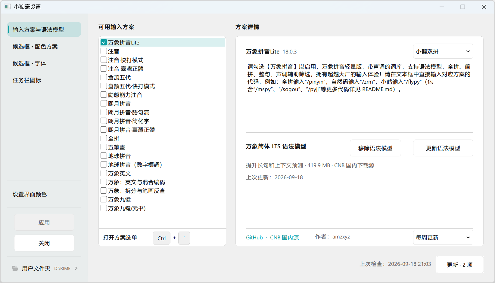
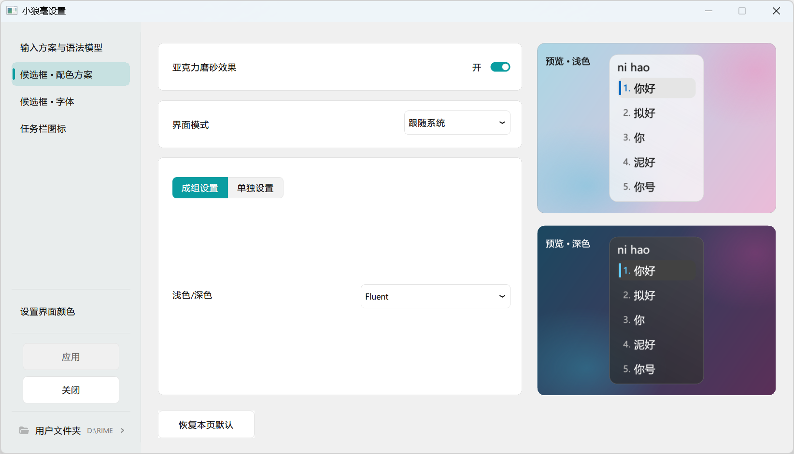
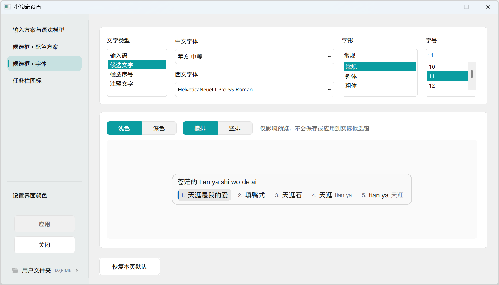
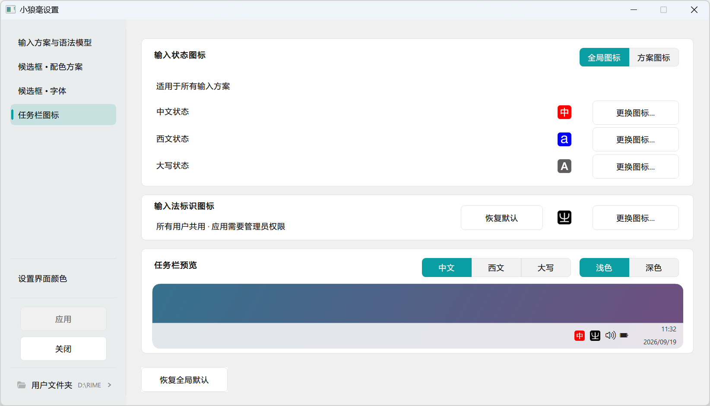

【小狼毫】輸入法
================

本仓库基于[原版小狼毫 Weasel](https://github.com/rime/weasel)和[中州韵 Rime 输入法引擎](https://github.com/rime/librime)开发，图形化设置与万象拼音 Lite 等增强功能的源码已合入 `master`。**本仓库不是 Rime 官方发布版**；原版小狼毫的介绍、使用方法和致谢保留在下文。

## 本版功能

| 功能 | 内容 |
| --- | --- |
| 集中设置 | 从任务栏图标右键菜单的「输入法设定」进入，管理输入方案与语法模型、候选框配色、候选框字体、任务栏图标；各页面的待应用更改会统一提示。 |
| 万象拼音 Lite | 安装包内置可直接使用的 Lite 方案；设置页可选择方案、检查和安装更新。更新优先使用 CNB 国内源，保留用户词典、根目录的 `*.custom.yaml` 和其他方案目录。 |
| 可选语法模型 | 万象简体 LTS 语法模型可单独下载、更新或移除。**语法模型不包含在安装包中**；不下载也能使用 Lite 方案。 |
| 候选框外观 | 通过图形界面设置浅色、深色配色及不同文字类型的字体、字号，并预览候选框；支持亚克力磨砂效果。 |
| 任务栏图标 | 分别设置中文、西文、大写锁定状态图标，选择全局或方案图标，预览浅色和深色任务栏；也可更换输入法标识图标，后者需要管理员授权。 |
| 设置界面外观 | 设置窗口可跟随系统、始终浅色或始终深色。强调色可跟随 Windows、使用默认色 `#0A9DA1`，或通过取色器、颜色代码和 HEX/RGB/HSV/HSL/CMYK 数值自定义。 |

## 设置界面预览

以下截图来自本地隔离的设置预览，展示输入方案、候选框和任务栏图标的实际界面。

### 输入方案与语法模型

### 候选框配色

### 候选框字体

### 任务栏图标

## 下载与使用

1. 从[本仓库发布页](https://github.com/nbzQing/weasel/releases)下载安装包，具体功能与架构以对应 Release 的说明为准。最新 `master` 源码可能尚未制成安装包；语法模型始终单独下载，不随安装包提供。
2. 初次安装时，在「安装选项」中选择输入语言。新用户首次部署默认启用万象拼音 Lite；已有用户的方案选择和自定义配置会保留。
3. 在 Windows 输入法列表中选择小狼毫。右键单击任务栏中的小狼毫图标，打开「输入法设定」；修改输入法设置后点击「应用」。

用户词典和配置文件默认位于 `%AppData%\Rime`；如果更改过用户目录，以设置窗口「用户文件夹」显示的路径为准。直接编辑配置文件后，仍须重新部署。方案选单快捷键以当前方案配置为准，通常可使用 <kbd>Ctrl+`</kbd> 或 <kbd>F4</kbd>。

本分支新增功能的问题与建议，请到[本仓库 Issues](https://github.com/nbzQing/weasel/issues)反馈；原版小狼毫和 Rime 的资料与反馈入口见下文。

## 原版小狼毫介绍与致谢

以下保留上游原版的介绍、安装和使用说明。原版发布链接与徽章指向 [rime/weasel](https://github.com/rime/weasel)；本定制分支的安装包请从上方的本仓库发布页下载。

基於 中州韻輸入法引擎／Rime Input Method Engine 等開源技術

式恕堂 版權所無

授權條款：GPLv3

項目主頁：https://rime.im

您可能還需要 RIME 用於其他操作系統的發行版：

  * ibus-rime、fcitx5-rime 或 fcitx-rime 用於 Linux
  * 【鼠鬚管】用於 macOS （64位）

安裝輸入法
----------

本品適用於 Windows 8.1 ~ Windows 11

初次安裝時，安裝程序將顯示「安裝選項」對話框。

若要將【小狼毫】註冊到繁體中文（臺灣）鍵盤佈局，請在「輸入語言」欄選擇「中文（臺灣）」，再點擊「安裝」按鈕。

安裝完成後，仍可由開始菜單打開「安裝選項」更改輸入語言。

使用輸入法
----------

選取輸入法指示器菜單裏的【中】字樣圖標，開始用小狼毫寫字。

可通過快捷鍵 <kbd>Ctrl+`</kbd> 或 <kbd>F4</kbd> 呼出方案選單、切換輸入方式。

定製輸入法
----------

通過 開始菜單 » 小狼毫輸入法 訪問設定工具及常用位置。

用戶詞庫、配置文件位於 `%AppData%\Rime`，可通過菜單中的「用戶文件夾」打開。高水平玩家調教 Rime 輸入法常會用到。

修改詞庫、配置文件後，須「重新部署」方可生效。

定製 Rime 的方法，請參考 Wiki [《定製指南》](https://github.com/rime/home/wiki/CustomizationGuide)。如需定製 Weasel 獨有的樣式和行為，請參考本倉庫 [Wiki 頁面](https://github.com/rime/weasel/wiki)。

致謝
----

### 輸入方案設計：

  * 【朙月拼音】系列及【八股文】詞典
    - 部分數據來源於 CC-CEDICT、Android 拼音、新酷音、opencc 等開源項目
    - 維護者：佛振、瑾昀
  * 【注音／地球拼音】
    - 維護者：佛振、瑾昀
  * 【倉頡五代】
    - 發明人：朱邦復先生
    - 碼表源自 www.chinesecj.com
    - 構詞碼表作者：惜緣

  【五笔】【粵拼】【上海／蘇州吳語】【中古漢語拼音】【國際音標】等衆多方案
  不再以安裝包預裝形式提供。可由 <https://github.com/rime/plum> 下載安裝。

### 程序設計：

  * [佛振](https://github.com/lotem)
  * [鄒旭](https://github.com/zouxu09)
  * [Xiangyan Sun](https://github.com/wishstudio)
  * [Prcuvu](https://github.com/Prcuvu)
  * [nameoverflow](https://github.com/nameoverflow)
  * [fxliang](https://github.com/fxliang)
  * [Azuk 443](https://github.com/determ1ne)

  查看更多 [代碼貢獻者](https://github.com/rime/weasel/graphs/contributors)

### 美術：

  * 圖標設計／[Patricivs](https://github.com/Patricivs)
  * 配色方案／Aben、P1461、Patricivs、skoj、佛振、五磅兔

### 本品引用了以下開源軟件：

  * [Boost C++ Libraries](http://www.boost.org/) (Boost Software License)
  * [curl](https://curl.haxx.se/) (MIT/X derivate license)
  * [google-glog](https://github.com/google/glog) (BSD 3-Clause License)
  * [Google Test](https://github.com/google/googletest) (BSD 3-Clause License)
  * [LevelDB](https://github.com/google/leveldb) (BSD 3-Clause License)
  * [librime](https://github.com/rime/librime) (BSD 3-Clause License)
  * [marisa-trie](https://github.com/s-yata/marisa-trie) (BSD 2-Clause License, LGPL 2.1)
  * [OpenCC / 開放中文轉換](https://github.com/BYVoid/OpenCC) (Apache License 2.0)
  * [plum](https://github.com/rime/plum) (GNU Lesser General Public License v3.0)
  * [WinSparkle](https://github.com/vslavik/winsparkle) (MIT License)
  * [yaml-cpp](https://github.com/jbeder/yaml-cpp) (MIT License)
  * [7-Zip](https://www.7-zip.org) (GNU LGPLv2.1+ with unRAR restriction)

問題與反饋
----------

發現程序有 bug，請到 GitHub 反饋
<https://github.com/rime/weasel/issues>

歡迎提交 pull request
<https://github.com/rime/weasel/pulls>

Rime 輸入法（不限於 Windows 平臺）功能、使用方法與配置相關的問題，請反饋到
<https://github.com/rime/home/issues>

聯繫方式
--------

技術交流，歡迎光臨 [Rime 代碼之家](https://github.com/rime/home)，或致信 Rime 開發者 <rimeime@gmail.com>

謝謝！
